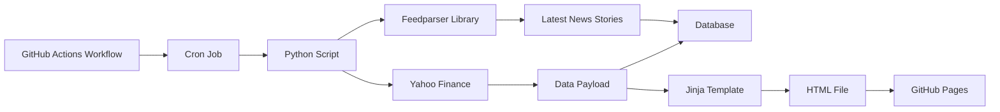

# Trending Tickers

## Motivation

Automated hourly scraping of stock market data and the storage thereof in a database.

## Approach

Using a GitHub Actions workflow, a cron job, and a Python script to automate the scraping of the trending tickers on Yahoo Finance. The data payload is used along with a Jinja template to produce an HTML file that triggers a separate workflow that renders the page using GitHub Pages; the data is inserted into a SQLite database. The Python script also contains logic that uses a library called `feedparser` to iteratively read in the latest news stories by ticker, which can be fed into downstream pipelines.

## Results

